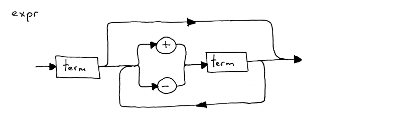

# SimpleInterpreter
用C#实现一个简单的解释器

该项目的实现会更注重原理，不会过多关注于性能，一些装箱拆箱引起的GC问题后续可以用Native来优化

参考博客:[https://ruslanspivak.com/lsbasi-part1/]

## 笔记记录
### 2022.12.17

几个涉及解释器功能模块划分的名词:**token, lexical analyzer, lexeme, parsing, parser**

#### 什么是token？
token是一个具有type 和value 的对象
``` c#
    public Token(TokenType type, Object value)
    {
        this.Type = type;
        this.Value = value;
    }
```
#### 什么是Lexical analyzer(lexer)?
将输入流分割成不同token的模块被称为lexical analyzer

#### 什么是Lexeme？
构成token的字符序列被称为lexeme， 比如'1112'是一个lexeme，对应的token为{type=int, value=1112}

#### parsing与parser(lexical analyzer)
parser其实是lexical analyzer的另一个名字，作为解释器的一部分，分析输入流构成的部分被称为parsing。

parser关注于token之间的联系,比如负责识别(1+1)是(int->plus->int)还是(int->minus->int)

解释器根据该关系最终返回一个结果。

#### what is syntax diagram?
语法规则的流程图



