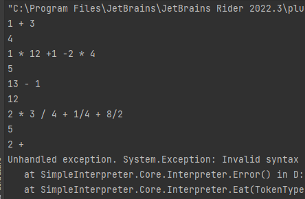
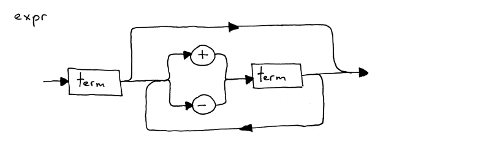
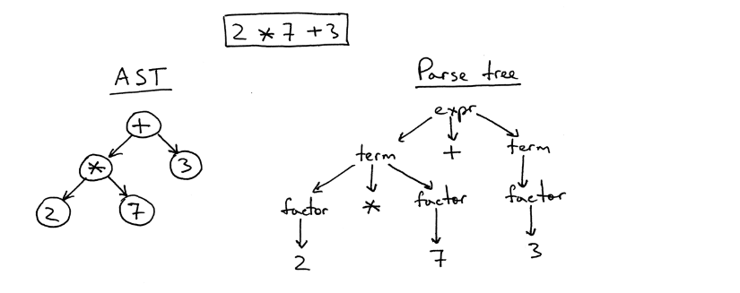

# SimpleInterpreter
用C#实现一个简单的解释器

该项目的实现会更注重原理，不会过多关注于性能，一些装箱拆箱引起的GC问题后续可以用Native来优化

参考博客:[https://ruslanspivak.com/lsbasi-part1/]

github:[https://github.com/HeJiZi/SimpleInterpreter]

## 文档目录
[1.项目目录](#项目目录)

[2.笔记（实现过程记录）](#笔记)
- [2022-12-17（实现加减乘除解释器）](#2022-12-17)
- [2022-12-18（实现抽象语法树）](#2022-12-18)
- [2022-12-24（实现脚本语法，语法树可视化）](#2022-12-24)


## 项目目录
```
|-- Core 核心文件夹，在这里实现解释器的核心类
    |-- Interpreter 解释器模块
        |-- Interpreter.cs 解释器，负责解释抽象语法树(AST)来执行逻辑
        |-- NodeVisitor.cs 解释器的父类，用于动态映射AST结点的处理函数
    |-- Structs 解释器需要用到的数据结构
        |-- AST.cs 抽象语法树结点
        |-- Token.cs 
    |-- Lexer.cs 负责将输入流拆分成不同的token并返回
    |-- Parser.cs 负责将Token转化为AST
|-- Doc 文档及需要用到的图片资源
|-- Tool 工具模块
    |-- AstVisualUtil.cs 抽象语法树打印模块
|-- Program.cs 实现main函数，解释器入口
```
## 笔记
### 2022-12-17
#### 阶段性结果
实现interpreter, lexer, token三个模块,将语法规则描述翻译成代码，完成了能够解析整形加减乘除的解释器



#### 笔记内容
几个涉及解释器功能模块划分的名词:**token, lexical analyzer, lexeme, parsing, parser**
#### 什么是token？
token是一个具有type 和value 的对象
``` c#
    public Token(TokenType type, Object value)
    {
        this.Type = type;
        this.Value = value;
    }
```
#### 什么是Lexical analyzer(lexer)?
将输入流分割成不同token的模块被称为lexical analyzer

#### 什么是Lexeme？
构成token的字符序列被称为lexeme， 比如'1112'是一个lexeme，对应的token为{type=int, value=1112}

#### Parsing与parser
当前的解释器实现版本里并无Parsing的过程，输入流被lexer划分为不同token后，解释器是直接对token进行操作来返回结果的。

在后续的实现版本里，parser会负责对token进行进一步处理，将其转化为解释器关心的中间语言（AST）。

随后解释器会对parser的返回结果执行逻辑。

#### What is syntax diagram?
语法规则的流程图



#### What is context-free grammars?
一种有些类似于正则表达式的语法规则描述，如以下就是一种grammar:
```
expr : factor((Mul|Div)facotr)*
factor : interger
```
每一行都是一条rule，上述的描述里表示我们实现的语言一共有两条rule

每一条rule由两个部分组成，冒号左边的被称为head，右边的被称为body（例子中的`expr`为head， `factor((Mul|Div)facotr)*` 为body）

body和head 又由 terminal 和non-terminal 组成， 像是Mul,Div,Interger的token被称为terminals，expr,factor被称为non-terminals。

左手边的non-terminal又被称为start symbol

\* 代表匹配零次或者多次，在上述例子中表示(Mul|Div)factor的模式出现0次或多次

笔记仅作为个人理解作用，更详细的解释可以看原文图解：[第四章](https://ruslanspivak.com/lsbasi-part4/)

### 2022-12-18
#### 阶段性结果
添加了括号语法，实现了抽象语法树与一元操作符

重新划分了模块，当前解释器的处理流程如下
```
 =========   Token   ==========   AST   ===============
 | Lexer |  -------> | Parser | ------> | Interpreter |
 =========           ==========         ===============
 
```

#### 笔记内容
#### 抽象语法树（AST）与 ParseTree
AST是一种用来描绘语法的树形结构，每一个中间结点都是操作符(operator)，每个叶子结点都是操作数(operand)



从图中可以看到，AST没有中间的语法结点 比起ParseTree更加简洁和紧凑。


### 2022-12-24
#### 阶段性结果
博客到了这里难度明显大了许多，而且由于实现语言与博客中不一样，有些用于调试的工具需要手动实现。

目前已经可以解析简单的Pascal语法了。以下是一个简单的Pascal程序模板：
```Pascal
PROGRAM Part10AST; {实现了头文件结构}
VAR {实现了变量的声明}
   a, b : INTEGER; {实现了整形}
   y    : REAL; {实现了实数}

BEGIN {Part10AST} {实现了注释}
   a := 2; {实现了赋值语句}
   b := 10 * a + 10 * a DIV 4; {实现了整形的除法}
   y := 20 / 7 + 3.14; {实现了浮点型的除法}
END.  {Part10AST}
```

将上面的文本导入解释器中，可以观测到解释器的变量为：
```
Key = a, Value = 2
Key = b, Value = 25
Key = y, Value = 5.997143
```
同时为了调试的方便，实现了打印抽象语法树的工具AstVisualUtil以及Token的打印。
#### 笔记内容
#### 如何实现python中的动态类型？
当引入实数类型后，Visit方法返回值类型便不确定了，不同类型的委托在c#中是无法注册在一起的，这时就需要引入动态类型来解决这个问题。

为了方便实现，项目里使用了C#中dynamic关键字，需要注意dynamic本质上的实现是用object，所以对值类型的操作是存在装箱和拆箱的。
#### 如何打印抽象语法树？
打印一棵树本身并没有太复杂的逻辑，只需要根据需求进行广度优先或者深度优先搜索就行。

但由于AST结点的子类很多，实现结构也千差万别，作为一个调试工具，自然不应该去影响运行时代码的实现结构，那么如何在不影响实现结构的情况下动态获取语法树结点的子节点呢？

因为调试工具并不存在太严格的性能要求，所以这里可以使用反射，动态获取结点的所有属性，如果属性是一个AST结点则会认为这是一个子节点。

通过这样的方式就可以比较方便的打印出整颗树了，考虑到观察的方便，项目中采用的是广度优先遍历，输出的结果如下：
```
Start:AST>
==============================Level:0==============================
Program Children=>Block,
==============================Level:1==============================
Block Children=>VarDecl, VarDecl, VarDecl, VarDecl, Compound,
==============================Level:2==============================
VarDecl Children=>Var`a`, Type`INTEGER`,
VarDecl Children=>Var`b`, Type`INTEGER`,
VarDecl Children=>Var`y`, Type`REAL`,
VarDecl Children=>Var`z`, Type`REAL`,
Compound Children=>Assign `:=`, Assign `:=`, Assign `:=`, Assign `:=`, NoOp,
==============================Level:3==============================
Var`a` Children=>
...
```


